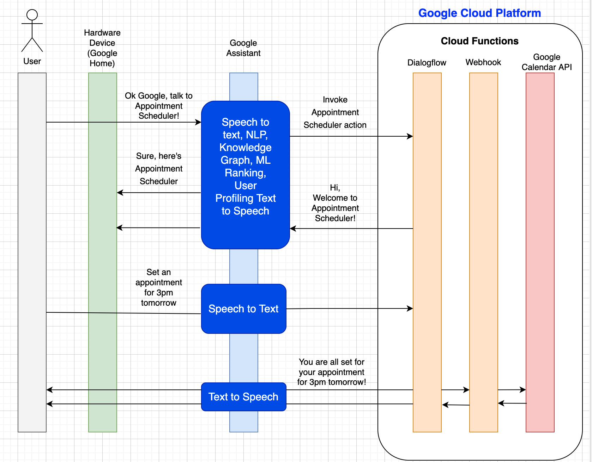
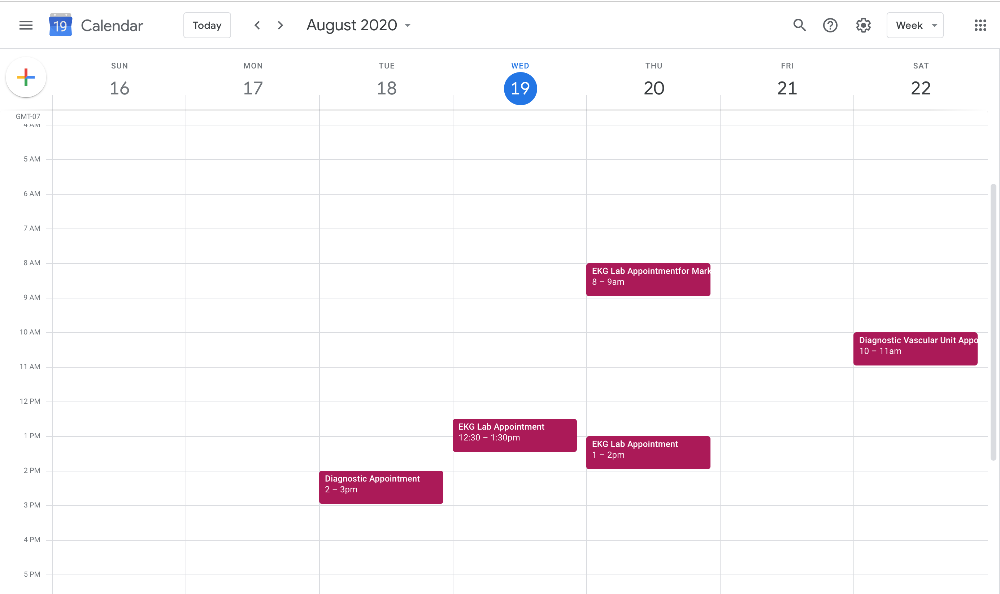
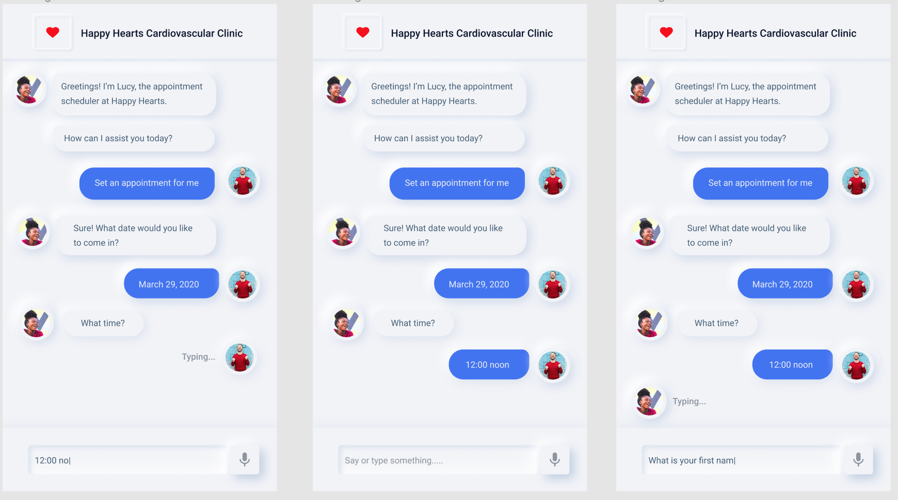

# Appointment Scheduler Bot for Happy Hearts Cardiovascular Clinic

## Introduction
For human beings, conversation is natural since it is a part of our everyday lives. We fundamentally understand it and all the nuances around it. This is why trying to teach a machine to have a conversation is very difficult. People tend to ask for information in various different ways, which makes the entire process even more complicated. For example, to ask Google Assistant or Alexa about the weather outside, I could use the following phrases:

What is the temperature now?

What is the weather like outside?

Is is going to rain tomorrow?

and this list goes on and on. 

To teach a machine to respond to all these questions, we would need a matrix of conditions to figure out all the edge cases for all the ways that the user could ask for a single information. This process is tedious and not practically maintainable. To overcome this issue, we use Natural Language Understanding(NLU). NLU is a technology that helps translate human language into computer language and vice versa. It is widely used in chatbots or conversational agents and redefines the customer experience in a personalized manner.

## Goal
I undertook this project to understand how NLU drives better conversations with users. I used Google Dialogflow to get a hands-on experience with building chatbots and training them to understand and respond to users' questions. Dialogflow is a service that lets you build conversation agents on top of our products and services. It provides a powerful NLU engine to process and understand what the users are looking for. The end deliverable of this project is a Dialogflow agent that schedules an appointment for patients at the Happy Heart Cardiovascular Clinic.

## Tasks Accomplished and Technologies Used
In this project, I have created a conversational agent that asks the user for his/her details. The agent checks whether an appointment slot is available on the date and time that the user desires. If yes, the agent confirms the appointment. Otherwise, it asks the user for another time slot. The agent adds the scheduled appointment to the user's [Google Calander](#integration-of-dialogflow-with-google-calendar).

To experiment with different technolgoies and to increase the functionality of the chatbot, I also integrated the agent with:

i)[Telephony Gateway](#integration-of-dialogflow-with-telephony-gateway)

ii)[Twilio Messaging Service](#integration-of-dialogflow-with-twilio-messaging-service)

iii)[Big Query on the Google Cloud Platform](#integration-of-dialogflow-with-bigquery)

iv)[Google Vision API]

A brief description of these integrations is explained in the following sections. To experiment with the UI, I designed a simple [front-end] for the agent using Django framework. I also designed a [Figma protoype](#neomoprohic-ux-prototype) of the chatbot UI for mobile applications using the minimal neomorphism design. 

## High-Level Architecture of the Application

### Integration of Dialogflow with Google Calendar

A chatbot needs to connect to a back end for transferring information to and fro from the business logic. In Dialoglfow, we make this connection using a fulfillment. A fulfillment is a piece of code that is deployed as a webhook and lets the Dialogflow agent call the business logic on a per-intent basis. During a conversation, this allows you to use the information extracted from Dialogflow's natural language processing to generate a dynamic response or to trigger an action on the back end. 
In this section, I learnt how Dialogflow connects with backend systems to provide rich and dynamic responses to user questions. I enhanced the conversation agent by creating a fulfillment. I enabled the Google Calendar API for the Google Cloud Platform(GCP) project and used those API credentials to connect my fulfillemnt cloud function with Google calendar. Finally, I tested my agent by creating appointment requests in Google Calender. The figure below demonstrates the workflow for the Google Calender functionality.

### Integration of Dialogflow with Telephony Gateway

The Telephony Gateway feature provides a telephone interface to the Dialogflow agent. It is used to build conversational IVR (interactive voice response) solutions that integrate with the rest of the call center network. Currently (the service is in beta), you can select a telephone number hosted by Google. The biggest advantage of the telephony gateway is that it can be used to create the agent for chat or messaging services and turn it into an IVR without much effort. You just assign a phone number to the chatbot that is already built and provide the same experience to users across the phone and web.

### Integration of Dialogflow with Twilio Messaging Service

In this section, I integrated Dialogflow with Twilio messaging service for SMS which allows to easily create Twilio bots with natural language understanding. Programmable SMS service from Twilio makes sending and receiving SMS easily. In order to test the agent and Twilio integration use text messaging on a phone. Send text message to the number that was assigned to the Twilio messaging service and chat with the agent.

### Integration of Dialogflow with BigQuery

I created a fulfillment using inline editor and integrated it with BigQuery. Using BigQuery,  the appointment data can be stored in a a database and queried and visualized to draw useful insights.

### Demo of the Agent:

#### Web Based View:

#### Chat Window Based View:

#### Dialogflow Tester Window Based View: 

#### Appointments Booked on the Google Calender:  

### Neomoprohic UX Prototype

Protoyped the UI of the agent using neumorphic design in Figma.A few screens of the prototype are given below:

The working prototype can be viewed at the following link: (Click on the mic icon at the bottom of the screen to navigate to the next screen)

https://www.figma.com/proto/q5Nw4E4Vu2hdenZ7jBKknb/Neumorphism-UI-Kit?node-id=91%3A231&scaling=scale-down

